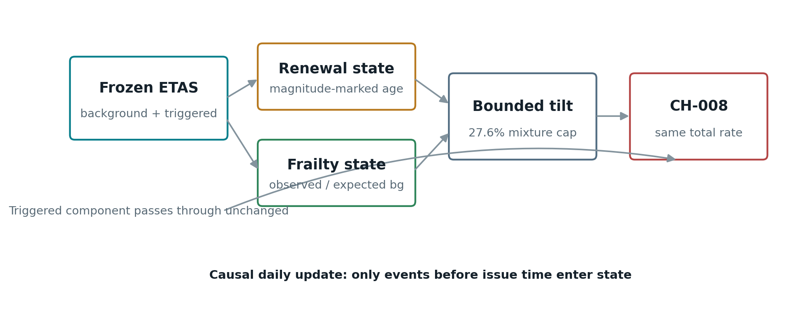
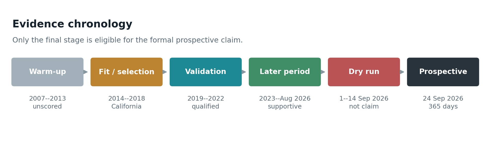

# CH-008: Causal Renewal-Frailty Reallocation of ETAS Background Seismicity Across California, New Zealand, and Chile

**Saban Baris Boga**
Independent Researcher, Adana, Turkiye
ORCID: https://orcid.org/0009-0000-9076-946X
Correspondence: hello@bboga.com

**Manuscript status:** Version 0.1, 16 September 2026. Pre-prospective methods and evidence paper. The formal 365-day prospective evaluation described here is scheduled to activate on 23 September 2026, with its first target day beginning at 00:00 UTC on 24 September 2026.

## Abstract

Epidemic-Type Aftershock Sequence (ETAS) models provide a strong, interpretable baseline for short-term earthquake forecasting, but their direct background component is commonly treated as stationary after fitting. We present CH-008, a causal post-ETAS model that preserves the fitted ETAS triggered component and the total expected event rate while reallocating a fixed fraction of direct background probability in space. The reallocation is driven by two pre-event state variables: a magnitude-marked Brownian renewal score, representing elapsed loading since local reset, and a decaying frailty score, representing persistent excess or deficit of posterior background-event mass relative to ETAS expectation. Parameters were selected using California data from 2014--2018 after an unscored warm-up from 2007. Evaluation was then performed on California development validation (2019--2022), a later California retrospective period (2023--18 August 2026), and exploratory external-region transfers to New Zealand (2008--2025) and Chile (2015--2025). Mean information gain per earthquake relative to frozen ETAS was +0.00521 in California validation (N=5,204), +0.00786 in the later California period (N=3,995), +0.01856 in New Zealand (N=2,270), and +0.00972 in Chile (N=1,909); 30-day and 90-day stationary-block bootstrap lower bounds were positive in all four evaluations. The California frailty increment over renewal alone was also positive in both evaluation periods. These results are supportive but not a confirmatory prospective claim: the later California interval is not pristine with respect to the preceding model-development sequence, and the New Zealand and Chile adapters were frozen in the same commits as their result artifacts. A public, frozen, daily three-region protocol will therefore compare CH-008 with frozen ETAS for 365 days. Its primary endpoint is pooled final paired information gain per earthquake, subject to predeclared event-count, uncertainty, operational-eligibility, and no-backfill rules.

**Keywords:** earthquake forecasting; ETAS; renewal process; frailty; information gain; prospective evaluation; CSEP

## 1. Introduction

Earthquake forecasts must separate two related but distinct sources of seismicity. Recent earthquakes induce strongly clustered aftershock activity, while tectonic loading and other persistent processes produce a background component that is less directly attributable to recent events. ETAS models formalize this decomposition as a conditional point process and remain a demanding baseline for short-term forecasting [1,2]. Their strength is precisely why incremental improvements should be judged by paired likelihood against a frozen ETAS implementation rather than by visual agreement, alarm counts, or an easier stationary reference.

CH-008 tests a narrow hypothesis: some forecastable structure remains inside the ETAS direct-background allocation after the triggered contribution has been accounted for. The model does not replace ETAS, add earthquake counts, or suppress its aftershock kernel. Instead, it conservatively moves a fixed fraction of ETAS background mass toward cells whose causal histories indicate (i) high renewal age after magnitude-dependent reset and (ii) persistent excess posterior background occurrence relative to ETAS expectation. The first signal represents local loading age. The second is a frailty-like residual memory that asks whether a location repeatedly produces more independently attributed seismicity than its baseline exposure predicts.

This paper has three aims. First, it specifies CH-008 sufficiently to distinguish the scientific hypothesis from its software implementation. Second, it reports the complete pre-prospective evidence hierarchy, including limitations that prevent retrospective results from being described as confirmatory. Third, it records the frozen design of a 365-day, three-region prospective test before its first scored target window.

CH-008 forecasts earthquake occurrence rates, not deterministic event times or exact future epicentres. A positive average information gain means that observed events received, on average, greater probability density under CH-008 than under ETAS while the total expected rate was held equal. It does not imply deterministic prediction, hazard certification, or operational public warning capability.

## 2. ETAS baseline and conserved-rate comparison

### 2.1 Conditional intensity

Let the fitted ETAS conditional intensity at time `t` and location `x` be

`lambda_E(t,x) = mu(x) + sum_{i:t_i<t} g(t-t_i, x-x_i | m_i)`,

where `mu(x)` is the direct background intensity and `g` is the marked triggering kernel. The implementation used here follows the published spatial-temporal ETAS parameterization reproduced from the EarthquakeNPP reference workflow, including finite-window temporal normalization, magnitude-dependent spatial kernels, boundary treatment, and the point-process compensator [1,2]. Source versions and numerical contracts are pinned in the public repository.

For each daily forecast, ETAS background mass in spatial cell `j` is `b_t(j)`. CH-008 constructs a reallocated background `b'_t(j)` such that

`sum_j b'_t(j) = sum_j b_t(j)`.

The challenger intensity is

`lambda_C(t,j) = lambda_E(t,j) + b'_t(j) - b_t(j)`.

Thus the ETAS triggered component and domain-integrated expected count are identical in the paired comparison. CH-008 can gain likelihood only by placing the conserved background mass more effectively in space.

### 2.2 Posterior background attribution

For an observed event `i`, the causal ETAS probability of direct-background attribution is

`p_bg(i) = mu(x_i) / lambda_E(t_i,x_i)`.

CH-008 uses this soft posterior mass rather than binary declustering. This avoids pretending that latent parentage is known and allows every state update to be computed from information available strictly before the next forecast window.

## 3. CH-008 state model

### 3.1 Magnitude-marked renewal age

Each event produces a bounded reset mark

`q(m) = min(1, 10^[gamma_m (m - M_full)])`.

With `M_full = 4.088951` and `gamma_m = 0.358966`, small events partially reset local age, while events at or above the saturation magnitude reset fully. If `E_t(j)` is normalized exposure accrued during day `t`, and `O_t(j)` is the neighborhood-mixed posterior reset mass, renewal age evolves as

`A_{t+1}(j) = [A_t(j) + E_t(j)] exp[-O_t(j)]`.

Age is converted to a hazard multiplier using a Brownian Passage Time renewal density with aperiodicity `alpha = 0.989282` [3]. Only positive log-hazard is retained:

`R_t(j) = max(log h_BPT(A_context,t(j)), 0)`.

The neighborhood context mixes local and adjacent fault-network or latent-grid states with weight 0.676500. California uses a UCERF3-derived fault-network representation [4]. New Zealand and Chile use causal cell-neighborhood operators on their frozen latent grids.

### 3.2 Residual frailty memory

Frailty compares decaying observed posterior background mass with decaying expected background exposure. With half-life `H = 430.582` days,

`delta = exp[-log(2)/H]`,

`X_{t+1}(j) = delta X_t(j) + expected_bg_t(j)`,

`Y_{t+1}(j) = delta Y_t(j) + observed_posterior_bg_t(j)`.

The local frailty score is

`F_local,t(j) = log[(a0 + Y_t(j))/(a0 + X_t(j))]`,

with prior exposure `a0 = 0.673873`. A 0.089383 neighborhood mixture is applied. Negative scores and values below the minimum log-frailty threshold 0.005165 are clipped to zero. The signal therefore promotes persistent positive emergence but does not create compensating negative suppression.

### 3.3 Conservative background tilt

The combined score is

`S_t(j) = 2.926204 R_t(j) + 0.582796 F_t(j)`.

Let `p0,t(j)` be normalized ETAS background probability. The tilted distribution is

`p_tilt,t(j) proportional to p0,t(j) exp[min(S_t(j), 4.0)]`.

The final background distribution is

`p_C,t(j) = (1-eta) p0,t(j) + eta p_tilt,t(j)`,

where `eta = 0.275925`. Therefore at least 72.4% of the original ETAS background distribution is retained directly in every forecast, in addition to the completely unchanged triggered component.

### 3.4 Regional exposure normalization

Catalog thresholds and cell scales differ substantially among California, New Zealand, and Chile. For transfer regions, raw renewal exposure is multiplied by

`c_region = 1 / mean_j[B_j D_pre]`,

where `B_j` is frozen ETAS background mass and `D_pre` is the number of days strictly before the evaluation period. The constant is computed only from pre-evaluation information and then frozen. It is not updated using retrospective or prospective target events. The formal prospective values are 1.0 for California, 0.4772598373 for New Zealand, and 4.2610459998 for Chile.

## 4. Data and regional adapters

### 4.1 California RELM

California forecasts use the RELM spatial mask with 7,682 cells at 0.1-degree spacing, a minimum magnitude of 2.5, and the USGS ANSS ComCat FDSN catalog. The baseline is the reproduced ComCat_25 ETAS model. CH-008 renewal neighborhoods follow the frozen UCERF3 fault network. State warm-up begins in 2007; 2014--2018 is the only parameter-selection interval; 2019 and later events were excluded from fitting.

### 4.2 New Zealand CSEP

New Zealand uses the published CSEP mask with 6,343 scoring cells at 0.1-degree spacing, represented internally by 302 active 0.5-degree latent cells. Events are obtained from the GeoNet FDSN Event Web Service with magnitude at least 4.0 and depth from 0 km inclusive to 40 km exclusive. ETAS was fit on 1987--2007 and evaluated on 2008--2025.

### 4.3 Chile subduction corridor

Chile uses a rectangular corridor from 76 W to 66 W and 56 S to 17 S, containing 1,560 cells at 0.5-degree spacing. The USGS ANSS ComCat FDSN catalog is filtered to magnitude at least 4.5 and depth from 0 km inclusive to 100 km exclusive. ETAS was fit on 2000--2014 and evaluated on 2015--2025. This two-dimensional depth-filtered representation does not separately model interface, intraslab, and shallow crustal regimes; that limitation is retained explicitly rather than tuned after inspection.

The three adapters, thresholds, grid hashes, baseline parameters, challenger code hashes, and catalog endpoints are fixed in the prospective protocol. Catalog responses, normalized rows, state files, forecasts, and manifests are stored with SHA-256 identities.

## 5. Experimental design and scoring

### 5.1 Parameter selection

The CH-008 parameter search used 64 scrambled Sobol candidates plus a control candidate on California 2014--2018. Selection used a robust annual objective rather than pooled mean alone. Candidate 43 was selected. Boundary-sensitivity checks expanded the renewal-weight upper bound from 2.5 to 4.0 and background-mixture upper bound from 0.3 to 0.5 without accessing later validation. The selected renewal weight 2.926204 lies in the expanded regime; the selected mixture 0.275925 does not lie at its bound.

### 5.2 Information gain

For observed target events `i=1,...,N`, the primary paired event score is

`IGPE = (1/N) sum_i log[lambda_C(t_i,x_i) / lambda_E(t_i,x_i)]`.

Because CH-008 and ETAS have equal domain-integrated daily rate by construction, their compensator difference is zero. The event-location log ratio is therefore also the full paired log-likelihood difference per event for these forecasts. `exp(IGPE)` is reported as a relative probability-density factor. Positive IGPE favors CH-008; negative IGPE favors ETAS.

Temporal dependence invalidates an independent-event confidence calculation. Uncertainty is estimated with 10,000-replicate stationary daily block bootstraps at mean block lengths of 30 and 90 days [5]. Annual or multi-year slices are reported as stability diagnostics and are not independently optimized.

### 5.3 Evidence labels

The evidence hierarchy is deliberately conservative:

1. **Development validation:** California 2019--2022 was untouched during CH-008 fitting, but it remained part of the broader iterative research program.
2. **Supportive later retrospective:** California 2023--18 August 2026 was locked for CH-008 evaluation, but predecessor experiments had previously scored portions of this period. It is not described as pristine independent confirmation.
3. **Exploratory external transfer:** New Zealand and Chile use zero-refit parameter transfer, but each regional adapter freeze and its result artifact occurred in the same commit. Their results are external evidence, not preregistered confirmation.
4. **Operational dry run:** September 2026 verifies daily publication, state advancement, scoring, incident handling, and public reporting. It is explicitly excluded from the scientific prospective claim.
5. **Formal prospective test:** The 365-day protocol is frozen before activation; no target events may be used for refitting, feature selection, regional exclusion, or backfilled forecasts.

## 6. Results

### 6.1 California development validation

On 5,204 California events in 2019--2022, CH-008 achieved IGPE +0.005213 relative to ETAS (relative factor 1.00523). The 95% stationary-block intervals were [0.001982, 0.008880] for 30-day blocks and [0.001844, 0.009216] for 90-day blocks. Every calendar year was positive. Gain increased in the prespecified low-ETAS subset (+0.022916), for magnitude at least 3.5 (+0.006805), and for magnitude at least 4.0 (+0.008580).

Renewal alone achieved +0.004411. The full model exceeded renewal alone by +0.000802 IGPE; the 30-day and 90-day lower bounds for this frailty increment were +0.000409 and +0.000401, respectively. Thus frailty contributed a small but separable gain rather than merely duplicating renewal age.

### 6.2 Later California retrospective period

On 3,995 events from 2023 through 18 August 2026, CH-008 achieved +0.007865 IGPE (relative factor 1.00790), with 30-day interval [0.005093, 0.010623] and 90-day interval [0.005369, 0.010914]. All annual slices were positive. Renewal alone achieved +0.006049; the full-model increment was +0.001816, with positive 30-day and 90-day lower bounds (+0.001238 and +0.001270). This period supports temporal persistence of the signal but retains the retrospective qualification described above.

### 6.3 External-region transfer

The zero-refit New Zealand transfer evaluated 2,270 events from 2008--2025 and produced +0.018561 IGPE (relative factor 1.01873; total log-likelihood gain 42.13). Its 30-day and 90-day intervals were [0.012006, 0.029671] and [0.011817, 0.031357]. All six non-overlapping three-year epochs were positive.

The zero-refit Chile transfer evaluated 1,909 events from 2015--2025 and produced +0.009718 IGPE (relative factor 1.00977; total gain 18.55). Its 30-day and 90-day intervals were [0.006862, 0.013219] and [0.006321, 0.014348]. All eleven annual values were positive.

These external results are encouraging because tectonic setting, catalog density, thresholds, and geometries differ from California. They cannot by themselves establish universal transferability, and their adapter-freeze provenance requires the exploratory label.

### 6.4 Operational dry run

The fixed dry-run target calendar covered 1--14 September 2026. As of 16 September, 12 days had provisional scores and six had completed the seven-day catalog-settlement delay. Two early days were missed because of a software defect and are excluded under the frozen downtime policy; they were not backfilled or assigned zero information gain. Across 38 provisional events, pooled IGPE was +0.021934. Across the 12 events then final, pooled IGPE was +0.032431. These small, incomplete operational samples are reported only to document system behavior and must not be interpreted as evidence for the formal claim.

## 7. Frozen prospective evaluation

The formal protocol `ch008-three-region-prospective-v1` activates on the 23 September 2026 issue cycle. Its first target window is 24 September 2026 00:00--24:00 UTC. Daily forecasts are generated independently for California, New Zealand, and Chile using only catalog data strictly before issue time and must be persisted before the target window opens. Publication after the deadline is rejected; retrospective forecast generation is prohibited.

The test lasts 365 fixed calendar days. First-observed catalog scores are labeled provisional. They are recomputed after seven days and the settled revision is labeled final. The primary endpoint pools final paired log gains across all three regions and divides by the pooled target-event count. Promotion requires all of the following:

- at least 500 pooled target earthquakes;
- mean pooled final IGPE greater than zero;
- 95% lower bounds greater than zero under both 30-day and 90-day stationary daily block bootstraps with 10,000 replicates;
- all three regions remaining operationally eligible;
- no post-hoc regional exclusion and no calendar extension.

If fewer than 500 events occur, the result is inconclusive rather than failed. A region becomes ineligible for the primary pooled claim if publication misses exceed 5% of its 365 scheduled region-days (19 days) or reach seven consecutive days. A scoring-service outage after an on-time forecast defers scoring and does not count as a publication miss. Missed publications are excluded from numerator and denominator, never imputed as zero IGPE. Invalidation makes the pooled three-region claim inconclusive, while secondary reporting continues.

The frozen model, ETAS baseline, regional adapters, and protocol are content-addressed. Any model or feature change requires a new protocol. Dry-run outcomes cannot be used to refit parameters. Public status and machine-readable state are available at https://etas.bboga.com/.

## 8. Discussion

CH-008's main scientific contribution is not a large raw likelihood advantage. It is a constrained test of where ETAS may leave residual spatial information. By conserving expected rate and retaining the complete triggered component, the design isolates the hypothesis that direct background risk is not fully stationary. The positive renewal-only results indicate that magnitude-marked elapsed age carries information. The additional positive full-minus-renewal results indicate that persistent posterior background excess also carries information after expected exposure is accounted for.

The gain is modest in California: relative probability-density factors are about 1.005--1.008 over broad samples. Small average gains can nevertheless accumulate over thousands of events and can be scientifically meaningful when measured against a strong nested baseline. They should not be confused with deterministic predictability or direct societal utility. The larger exploratory gains in New Zealand and Chile may reflect genuine portability, regional scaling, catalog properties, geometry, or some combination of these. Only frozen prospective operation can constrain those interpretations.

The model also has a useful falsification path. It can fail if prospective mean gain is non-positive, if temporal-block uncertainty includes zero, if gain is confined to one region, if the event gate is not reached, or if operations violate the frozen eligibility rules. Because the ETAS total rate is preserved, poor spatial reallocation cannot be hidden by tuning the expected count.

## 9. Limitations

Several limitations are material. First, all reported performance results before the formal activation are retrospective or operational. The evidence labels prevent them from being promoted to preregistered confirmation. Second, catalog completeness and network evolution can affect inferred background states. Fixed magnitude and depth thresholds reduce but do not eliminate this concern. Third, the Chile adapter treats a complex subduction system as one depth-filtered two-dimensional field. Fourth, ETAS posterior background probabilities inherit any misspecification or short-term aftershock incompleteness in the baseline. Fifth, `c_region` standardizes exposure scale but cannot guarantee tectonic equivalence. Sixth, the small dry-run sample is operational evidence only. Finally, the prospective test covers three regions and one year; even a successful result would require independent reproduction and broader evaluation before strong claims of geographic generality.

## 10. Reproducibility and availability

Source code, frozen configurations, model files, region definitions, result manifests, tests, and protocol documentation are available at https://github.com/ebolarium/earthquake-automata-challenge. The frozen pre-activation protocol and runtime snapshot is repository commit `6206583`; manuscript sources are maintained in the `paper/` directory. The live dashboard and machine-readable API are at https://etas.bboga.com/.

Input catalogs are obtained from the USGS ANSS ComCat FDSN Event Web Service and the GeoNet FDSN Event Web Service under their respective terms. The repository records source endpoints, query rules, hashes, and clean export procedures. Large catalog snapshots and daily binary forecast artifacts are stored operationally outside Git; availability of those artifacts should be stated explicitly in the final archived version after a durable public-access package is chosen.

## 11. Declarations

**Author contributions.** Saban Baris Boga conceived the study, defined the research objective and evaluation constraints, supervised the software-assisted implementation, reviewed the experiments, interpreted the results, and prepared the manuscript.

**Competing interests.** The author declares no competing interests.

**Funding.** This independent research received no external funding.

**Generative AI disclosure.** Generative AI systems were used as research-assistance tools for software implementation, documentation synthesis, language editing, and preparation of the manuscript draft under the author's direction. They are not authors. The author retains responsibility for the study, verification, interpretation, and submitted text.

**Ethics and safety.** The study uses public earthquake catalogs and does not involve human or animal subjects. The forecasts are research outputs and are not earthquake warnings or substitutes for official hazard information.

## References

1. Ogata, Y. (1988). Statistical models for earthquake occurrences and residual analysis for point processes. *Journal of the American Statistical Association*, 83, 9--27. https://doi.org/10.1080/01621459.1988.10478560
2. Mizrahi, L., Nandan, S., & Wiemer, S. (2021). Embracing data incompleteness for better earthquake forecasting. *Journal of Geophysical Research: Solid Earth*, 126, e2021JB022379. https://doi.org/10.1029/2021JB022379
3. Matthews, M. V., Ellsworth, W. L., & Reasenberg, P. A. (2002). A Brownian model for recurrent earthquakes. *Bulletin of the Seismological Society of America*, 92, 2233--2250. https://doi.org/10.1785/0120010267
4. Field, E. H., et al. (2013). Uniform California Earthquake Rupture Forecast, Version 3 (UCERF3): The time-independent model. U.S. Geological Survey Open-File Report 2013-1165. https://doi.org/10.3133/ofr20131165
5. Politis, D. N., & Romano, J. P. (1994). The stationary bootstrap. *Journal of the American Statistical Association*, 89, 1303--1313. https://doi.org/10.1080/01621459.1994.10476870
6. Rhoades, D. A., et al. (2010). Establishing a New Zealand earthquake forecast testing centre. *Pure and Applied Geophysics*, 167, 877--892. https://doi.org/10.1007/s00024-010-0082-4
7. Zlydenko, O., et al. (2023). A neural encoder for earthquake rate forecasting. *Scientific Reports*, 13. https://doi.org/10.1038/s41598-023-38033-9
8. Mizrahi, L., Nandan, S., & Wiemer, S. (2022). ETAS: Python package for fitting and simulating epidemic-type aftershock sequence models (software). Zenodo. https://doi.org/10.5281/zenodo.6583992
